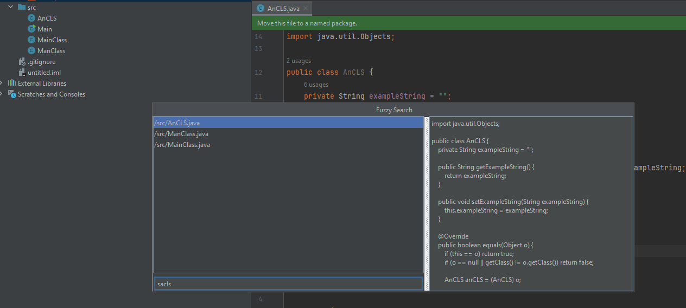
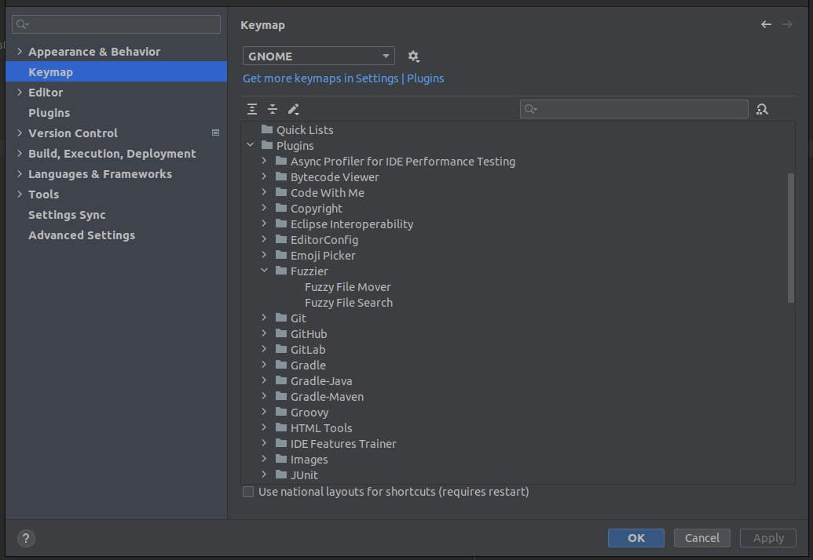

# Fuzzier - IntelliJ IDEA plugin
<p align="left">
    <a href="https://plugins.jetbrains.com/plugin/23451-fuzzier" alt="Downloads">
        
    </a>
    <a href="https://plugins.jetbrains.com/plugin/23451-fuzzier/versions" alt="Latest Version">
        
    </a>
    <a href="https://plugins.jetbrains.com/plugin/23451-fuzzier/reviews" alt="Plugin Reviews">
        
    </a>
</p>

A simple plugin to allow "fuzzy" file search with the UI inspired by [telescope.nvim](https://github.com/nvim-telescope/telescope.nvim)

If you are interested in plugin development you can check out my write-up about creating Fuzzier in 
[here](https://mituuz.com/content/fuzzier_development.html).

Supports spaces in the search string, splitting the string and searching for both parts separately. 
e.g. parts do not need to be in the correct order, as long as both succeed on their own.

When having a project open with multiple modules, the module folder is prepended to the file paths. 
This might be somewhat unstable as modules do not have a definite root folder. 
Current implementation uses the first content root.



## Usage
Double-clicking a list item opens the file

When focused on the search field, you can use:
- Arrow keys to move up and down
- CTRL + j to move down (modifiable through keymap)
- CTRL + k to move up (modifiable through keymap)
- Enter to open the currently selected file

List movement can be remapped from settings -> keymaps, but do not support chorded shortcuts.

## Features
- Fuzzy file finder
  - Search all except excluded files
  - Search only from VCS tracked files
- Text search by leveraging [ripgrep](https://github.com/BurntSushi/ripgrep), grep or findstr
- File mover

## Documentation
For a more thorough documentation of the plugin, please refer to the [Fuzzier Wiki](https://github.com/MituuZ/fuzzier/wiki).

The goal is to have a central place for all the documentation and to keep the README as a quick reference.

## Shortcuts
### Adding ideavim mapping for the plugin
Example of a .ideavimrc-row to add a vim keybinding for the plugin
```
map <Leader>pf <action>(com.mituuz.fuzzier.Fuzzier)
map <Leader>gf <action>(com.mituuz.fuzzier.FuzzierVCS)
map <Leader>mf <action>(com.mituuz.fuzzier.FuzzyMover)
map <Leader>ff <action>(com.mituuz.fuzzier.FuzzyGrep)
map <Leader>ff <action>(com.mituuz.fuzzier.FuzzyGrepCaseInsensitive)
```

### Adding an editor shortcut


## Installation
The plugin can be installed from the [JetBrains Marketplace](https://plugins.jetbrains.com/plugin/23451-fuzzier)

## Contact
I can be reached at <mitja@mituuz.com>.

## Contributing
I have a tendency to make some larger refactors from time to time, 
so I would appreciate it if you would open an issue before starting to work on a feature or a bug fix.

I'll help as I can and can give guidance on how to implement the feature or fix the bug, 
but cannot guarantee that I will accept the PR.
