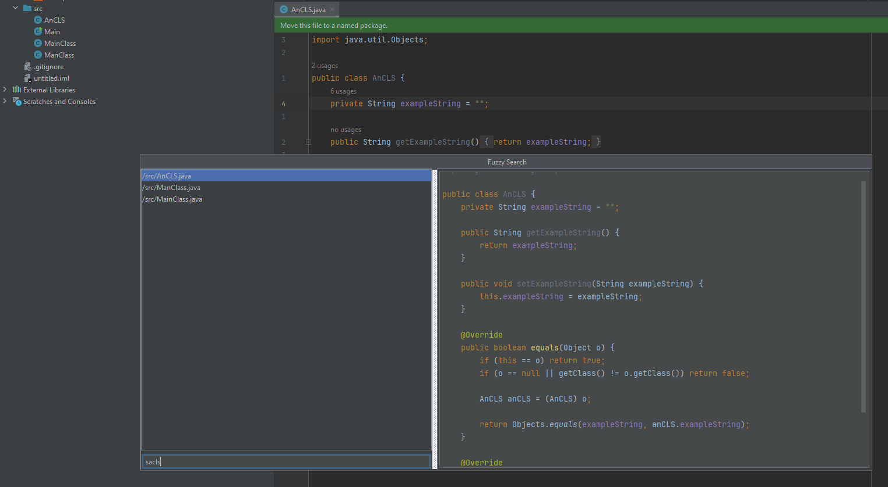

# Fuzzier - IntelliJ IDEA plugin
A simple plugin to allow "fuzzy" file search with the UI inspired by [telescope.nvim](https://github.com/nvim-telescope/telescope.nvim)

If you are interested in plugin development you can check out my write-up about creating Fuzzier in [here.](https://mituuz.com/content/fuzzier_development.html)

Does **not** support true fuzzy finding. All search characters must be present and in correct order in the file path, but do not need to be sequential.



## Usage
You can open Fuzzier with a shortcut or from the Tools menu

Double-clicking a list item opens the file

When focused on the search field, you can use:
- Arrow keys to move up and down
- CTRL + j to move down
- CTRL + k to move up
- Enter to open the currently selected file (opens in current tab)

## Shortcuts
### Adding ideavim mapping for the plugin
Example of a .ideavimrc-row to add a vim keybinding for the plugin
```
map <Leader>pf <action>(com.mituuz.fuzzier.Fuzzier)
```

### Adding a shortcut for the plugin


## Installation
I'll work on getting the plugin to the JetBrains marketplace.

For now, the installation must be done manually by building the plugin and selecting the jar from the "Install Plugin From Disk"-option in the plugin menu


## Requirements (tested on)
IntelliJ IDEA version 2023.1.5 or later

## Potential improvements
- Configurable exclusion list
- Configurable search weights with a test bench

## Contact
I can be reached from <mituuuuz@hotmail.com>
