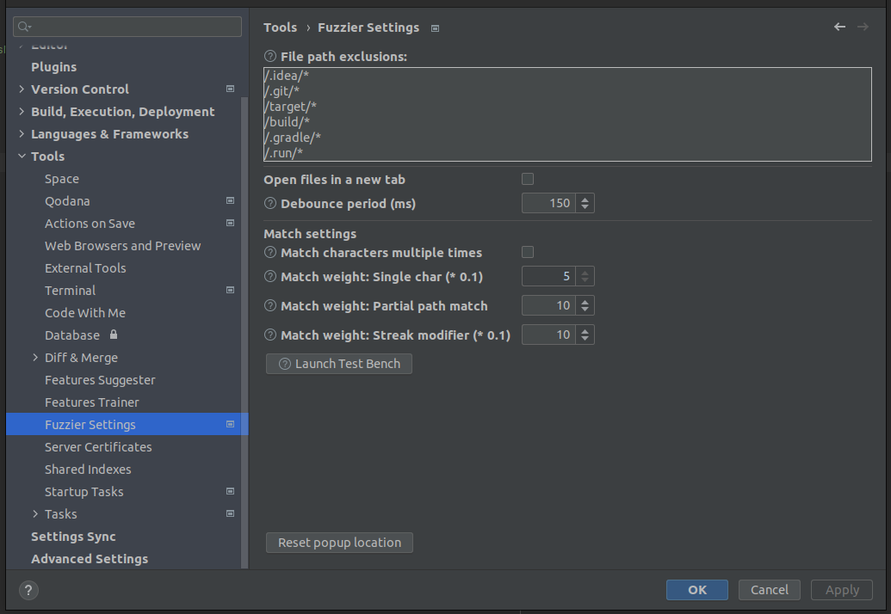

# Fuzzier - IntelliJ IDEA plugin
<p align="left">
    <a href="https://plugins.jetbrains.com/plugin/23451-fuzzier" alt="Downloads">
        
    </a>
    <a href="https://plugins.jetbrains.com/plugin/23451-fuzzier/versions" alt="Latest Version">
        
    </a>
    <a href="https://plugins.jetbrains.com/plugin/23451-fuzzier/reviews" alt="Plugin Reviews">
        
    </a>
</p>

A simple plugin to allow "fuzzy" file search with the UI inspired by [telescope.nvim](https://github.com/nvim-telescope/telescope.nvim)

If you are interested in plugin development you can check out my write-up about creating Fuzzier in [here.](https://mituuz.com/content/fuzzier_development.html)

Does **not** support true fuzzy finding. All search characters must be present and in correct order in the file path, 
but do not need to be sequential.

Supports spaces in the search string, splitting the string and searching for both parts separately. 
e.g. parts do not need to be in the correct order, as long as both succeed on their own.


## Usage
You can open Fuzzier with a shortcut or from the Tools menu. There is an action to fuzzy search over all files or over
only VCS tracked files.

Double-clicking a list item opens the file

When focused on the search field, you can use:
- Arrow keys to move up and down
- CTRL + j to move down
- CTRL + k to move up
- Enter to open the currently selected file (opens in current tab)

### File operations
Fuzzier can be used to move files using the same search to locate the file and target directory that is used for 
searching files. File Mover defaults to current file when search string is empty.

## Settings
Settings → Tools → Fuzzier Settings



### Excluding files from the search
You exclude files and file paths by adding them to the file exclusion list.
No empty strings or comments are supported.

All files in the project begin with `/` at the start of the file path.

#### Options for exclusions are as follows:
- Ends with
  - e.g. `*.log`
  - excludes all files that end with `.log`
- Starts with
  - e.g. `/build*`
  - excludes all files from the project root that start with `build`
  - excludes all files under folders that start with `build`
  - to exclude only folders do append `/` at the end. e.g. `/build/*`
- Contains
  - e.g. `ee`
  - excludes all files and folders that have the string `ee` in them

### Open files in a new tab
Decides whether Fuzzier opens a file to a new tab or not.

#### Tip
Can be combined with the editors tab amount limit. e.g. set the limit to 1 and open files in a new tab to allow splitting and changing files with vim commands (:sp and :vs)

### Debounce period
You can manually set a time after which the search processes the current search string. 
This allows inserting multiple characters before starting the process.

Defaults to 150 and can be set from 0 to 2000.

## Shortcuts
### Adding ideavim mapping for the plugin
Example of a .ideavimrc-row to add a vim keybinding for the plugin
```
map <Leader>pf <action>(com.mituuz.fuzzier.Fuzzier)
map <Leader>gf <action>(com.mituuz.fuzzier.FuzzierVCS)
map <Leader>mf <action>(com.mituuz.fuzzier.FuzzyMover)
```

### Adding a shortcut for the plugin


## Installation
The plugin can be installed from the [JetBrains Marketplace](https://plugins.jetbrains.com/plugin/23451-fuzzier)

## Contact
I can be reached from <mituuuuz@hotmail.com>
